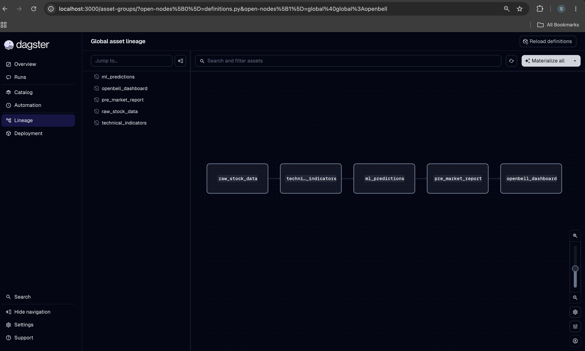
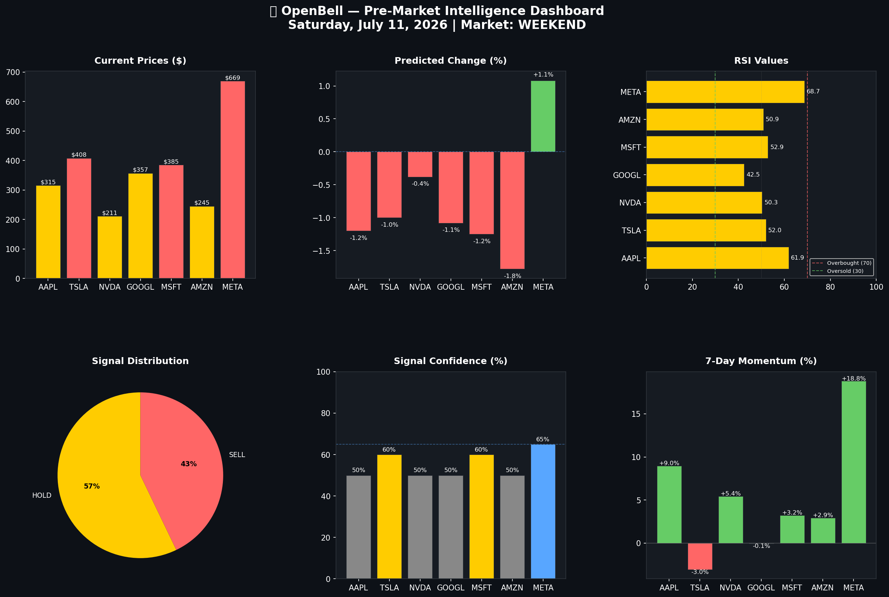

# 🔔 OpenBell

> Pre-market stock intelligence platform — rings before the market does.

**Stack:** Python · MapReduce · Yahoo Finance · scikit-learn · Dagster · Matplotlib  
**Coverage:** AAPL · TSLA · NVDA · GOOGL · MSFT · AMZN · META  
**Schedule:** Runs automatically every trading day at 8:00 AM ET

---

## What It Does

OpenBell fetches real stock data, computes 15+ technical indicators using a MapReduce pattern, trains an ensemble ML model, generates a pre-market intelligence report, and orchestrates everything with Dagster — all before 9:30 AM ET market open.

Every morning you get:
- BUY / SELL / HOLD signals with confidence scores
- Next-day price predictions with MAE metrics
- RSI, MACD, Bollinger Band analysis per stock
- Volatility alerts for high-risk stocks
- 6-panel visual analytics dashboard

---

## Global Asset Lineage (Dagster)



The pipeline is orchestrated as 5 Dagster software-defined assets showing full data lineage from raw Yahoo Finance data to the final dashboard.

---

## Analytics Dashboard



---

## Architecture
```
Every trading day at 8:00 AM ET
↓
┌─────────────────────────┐
│  raw_stock_data         │  Yahoo Finance API → 501 days OHLCV per stock
│  pipeline/fetch_data.py │  7 stocks, real data
└───────────┬─────────────┘
↓
┌─────────────────────────┐
│  technical_indicators   │  MAP: compute indicators per stock in parallel
│  hadoop/mapreduce/      │  REDUCE: generate signals across portfolio
│                         │  RSI · MACD · Bollinger Bands · ATR · Volume
└───────────┬─────────────┘
↓
┌─────────────────────────┐
│  ml_predictions         │  Random Forest + Gradient Boosting ensemble
│  pipeline/predict.py    │  14 features · 80/20 time-series split
│                         │  Predicts next-day closing price + % change
└───────────┬─────────────┘
↓
┌─────────────────────────┐
│  pre_market_report      │  Full intelligence briefing
│  pipeline/report.py     │  Signals + predictions + opportunities + alerts
└───────────┬─────────────┘
↓
┌─────────────────────────┐
│  openbell_dashboard     │  6-panel dark-theme visual analytics
│  dashboard/             │  Prices · RSI · Momentum · Signals · Confidence
└─────────────────────────┘
```

---

## Sample Pre-Market Report

=================================================================
O P E N B E L L  —  P R E - M A R K E T  I N T E L L I G E N C E
Generated : Friday, July 11, 2026 at 08:00 AM ET
Market    : PRE-MARKET
Coverage  : 7 stocks tracked
SELL signals : 3 stocks ['TSLA', 'MSFT', 'META']
HOLD signals : 4 stocks ['AAPL', 'NVDA', 'GOOGL', 'AMZN']
Stock     Price     Pred    Chg% Signal           RSI  Conf
AAPL   $ 315.32 $ 311.54 ▼  1.2% HOLD            61.9   50%
TSLA   $ 407.76 $ 403.70 ▼  1.0% SELL            52.0   60%
META   $ 669.21 $ 676.41 ▲  1.1% SELL            68.7   65%
HIGH VOLATILITY ALERT: ['TSLA', 'META']

---

## Technical Indicators (MapReduce Pattern)

| Indicator | Description |
|-----------|-------------|
| RSI (14) | Relative Strength Index — overbought/oversold |
| MACD | Moving Average Convergence Divergence |
| Bollinger Bands | Price volatility bands (20-day, 2σ) |
| ATR | Average True Range — volatility measure |
| MA 7/20/50/200 | Moving averages — trend direction |
| Volume Ratio | Current volume vs 20-day average |
| Momentum 7d/30d | Price change over 7 and 30 days |
| Volatility 20d | Annualized 20-day rolling volatility |

---

## ML Model

- **Algorithm:** Random Forest + Gradient Boosting ensemble (50/50 weight)
- **Target:** Next-day return → converted to price prediction
- **Features:** 14 technical indicators
- **Training:** 80% historical, 20% test (time-series split, no leakage)
- **Metrics:** MAE $2-7 per stock (honest — stock prediction is hard)

---

## Running Locally

```bash
# 1. Clone
git clone https://github.com/Sakshi3027/openbell.git
cd openbell

# 2. Install
pip install -r requirements.txt

# 3. Run pipeline manually
python3 pipeline/fetch_data.py
python3 hadoop/mapreduce/technical_indicators.py
python3 pipeline/predict.py
python3 pipeline/report.py
python3 dashboard/openbell_dashboard.py

# 4. Run with Dagster (asset lineage UI)
dagster dev -w workspace.yaml
# Open http://localhost:3000 → Lineage → Materialize all

# 5. Run scheduler (8:00 AM ET daily)
python3 scheduler/morning_bell.py
```

---

## Project Structure
```
openbell/
├── pipeline/
│   ├── fetch_data.py              # Yahoo Finance ingestion
│   ├── predict.py                 # ML ensemble predictions
│   └── report.py                  # Pre-market intelligence report
├── hadoop/
│   └── mapreduce/
│       └── technical_indicators.py  # MapReduce indicator engine
├── dagster_pipeline/
│   ├── assets.py                  # 5 Dagster software-defined assets
│   ├── schedules.py               # 8:00 AM ET Mon-Fri schedule
│   └── definitions.py             # Dagster definitions
├── dashboard/
│   └── openbell_dashboard.py      # 6-panel visual dashboard
├── scheduler/
│   └── morning_bell.py            # Standalone daily scheduler
├── docs/
│   ├── lineage.png                # Dagster asset lineage screenshot
│   └── dashboard.png              # Analytics dashboard
└── workspace.yaml                 # Dagster workspace config
```

---

Built by [Sakshi Chavan](https://github.com/Sakshi3027) · MS Data Science